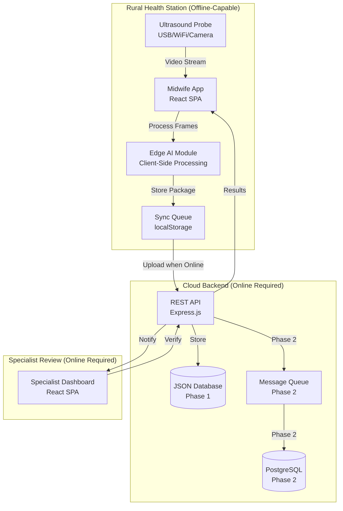

# Technical Design Document: Kalinga AI Maternal Health System

## Overview

Kalinga AI is an offline-first diagnostic triage system designed to reduce maternal mortality in the Philippines by empowering rural midwives with AI-assisted ultrasound diagnostics. The system operates in Geographically Isolated and Disadvantaged Areas (GIDA) with intermittent or no internet connectivity, utilizing a store-and-forward architecture where data is captured locally and synchronized with specialists asynchronously.

### System Context

The Philippines faces significant maternal mortality challenges in GIDA regions where specialized obstetric care is unavailable. Department of Health (DOH) ultrasound equipment sits idle in rural health stations because local midwives lack specialized training. Kalinga AI bridges this gap by providing real-time guidance during ultrasound capture, automated quality assessment, and asynchronous specialist verification.

### Implementation Phases

**Phase 1 (Current - MVP)**: Functional offline-first architecture with rules-based risk scoring and simulated AI components. This phase validates the workflow, user experience, and deployment model without requiring trained AI models or specialized hardware integration.

**Phase 2 (Planned)**: Integration of trained AI models (FetalCLIP for ultrasound analysis, CNN for probe guidance), real ultrasound probe connectivity (USB/Wi-Fi), AES-256 encryption, production database (PostgreSQL), and enhanced security features.

### Design Principles

1. **Offline-First**: Core functionality operates without network connectivity
2. **Human-in-the-Loop**: AI predictions require specialist validation before clinical decisions
3. **Store-and-Forward**: Asynchronous architecture minimizes real-time connectivity requirements
4. **Progressive Enhancement**: Phase 1 simulations establish workflow; Phase 2 adds AI sophistication
5. **Zero-Compile Deployment**: Phase 1 uses JSON file-based storage for rapid deployment without database setup
6. **Mobile-First**: Primary interface optimized for midwife use on tablets/phones in field conditions

## Architecture

### System Components



### Architectural Pattern: Store-and-Forward with Offline-First Design

The system implements a **store-and-forward telemedicine architecture** where:

1. **Capture Phase** (offline-capable): Midwife registers patient, captures ultrasound frames with AI guidance, compiles triage package
2. **Storage Phase** (offline-capable): Complete triage package stored in browser localStorage with transaction locks
3. **Forward Phase** (requires connectivity): Manual or automatic upload to cloud backend when network available
4. **Review Phase** (requires connectivity): Specialist reviews cases through web dashboard
5. **Result Delivery** (requires connectivity): Midwife polls for and retrieves specialist verdicts

This pattern minimizes connectivity requirements to only the upload and notification retrieval steps, allowing the critical diagnostic capture workflow to proceed regardless of network availability.

### Technology Stack

#### Midwife App (Client)

- **Framework**: React 18 with Vite build system
- **State Management**: React useState/useEffect hooks (no external state library)
- **Routing**: React Router v6
- **Storage**: Browser localStorage for offline data persistence
- **API Communication**: Native fetch API with manual error handling
- **Media Capture**: WebRTC getUserMedia API for camera/video access
- **Styling**: Custom CSS with CSS variables for theming

#### Cloud Backend (Server)

- **Framework**: Express.js (Node.js)
- **Phase 1 Database**: JSON file-based storage (`server/data/db.json`)
- **Phase 2 Database**: PostgreSQL with Sequelize ORM or MongoDB with Mongoose
- **Phase 2 Queue**: RabbitMQ or AWS SQS for asynchronous processing
- **API Design**: RESTful HTTP endpoints with JSON payloads
- **Phase 2 Encryption**: AES-256 for data at rest, TLS 1.3 for data in transit

#### Edge AI Module (Client-Side)

- **Phase 1**: Rules-based risk scoring algorithms in JavaScript
- **Phase 2**: TensorFlow Lite or PyTorch Mobile for on-device inference
- **Phase 2 Models**:
  - FetalCLIP: Zero-shot ultrasound plane classification (<100MB)
  - CNN Guidance: Real-time probe positioning feedback (<50MB)
  - Frame Selection: Quality assessment and filtering (<100MB)

#### Specialist Dashboard (Client)

- **Framework**: React 18 (shared codebase with Midwife App)
- **Authentication**: Phase 1 - No auth; Phase 2 - JWT-based session management
- **UI Components**: Desktop-optimized layouts with image zoom controls

### Deployment Architecture

**Phase 1 (MVP)**:

```
[Midwife Tablet/Phone] ← WiFi/Cellular → [Cloud Server: Node.js + JSON DB]
         ↓
  [localStorage]                                    ↓
                                          [Specialist Browser]
```

**Phase 2 (Production)**:

```
[Midwife Device] ← WiFi/Cellular → [Load Balancer]
         ↓                                ↓
  [localStorage]              [API Servers (Auto-scaling)]
         ↓                                ↓
    [Edge AI]                    [Message Queue]
                                          ↓
                                  [PostgreSQL Cluster]
                                          ↓
                                 [Specialist Browser]
```

## Components and Interfaces

### 1. Midwife App Component

**Purpose**: Primary user interface for rural midwives to capture patient data, perform ultrasound scans with AI guidance, and receive specialist verification results.

**Key Modules**:

#### 1.1 Patient Registration Module

- **Location**: `client/src/pages/PatientRegistration.jsx`
- **Functionality**: Captures demographic and clinical data including PhilHealth ID, name, DOB, vitals (BP, weight, height), risk factors (chronic hypertension, family history, diabetes, previous C-section, etc.)
- **Validation**: PhilHealth ID format validation, required field checking, BMI auto-calculation
- **Phase 1 Feature**: Mock ID scanner button that auto-fills demo data for stakeholder demonstrations
- **Storage**: Saves to localStorage immediately upon completion

#### 1.2 Probe Connection Module

- **Location**: `client/src/pages/RegisteringTriageSession.jsx`
- **Phase 1 Implementation**: Animated searching screens displaying 8 rotating probe connection frames for 2.5 seconds
- **Phase 2 Implementation**: Actual device discovery using WebUSB API (for USB probes) or WebRTC (for WiFi probes)
- **Error Handling**: Timeout after 30 seconds with troubleshooting guidance

#### 1.3 Ultrasound Scanning Module

- **Location**: `client/src/pages/ScanSimulator.jsx`
- **Core Workflow**:
  1. Initialize video feed (Phase 1: camera via getUserMedia; Phase 2: ultrasound probe stream)
  2. Display real-time guidance overlay with positioning instructions
  3. Capture frames during 15-second sweep with circular progress indicator
  4. Show simulated AI bounding boxes (Phase 1) or real FetalCLIP classifications (Phase 2)
  5. Display 6 thumbnail placeholders filling sequentially during sweep
- **Phase 1 Guidance**: Cycling text instructions ("Aligning transducer", "Hold steady", "Move up slowly"), directional arrows, animated guide star
- **Phase 2 Guidance**: Real-time CNN feedback based on actual probe positioning
- **Timing**: 15-second target sweep duration with auto-completion
- **Frame Storage**: Phase 1 stores references to static PNG assets; Phase 2 stores actual captured frames as base64 or blob references

#### 1.4 Triage Package Confirmation Module

- **Location**: `client/src/pages/ScanConfirmation.jsx`
- **Functionality**:
  - Displays preview of captured frames (6 thumbnails in grid)
  - Shows patient summary (name, age, vitals)
  - Displays computed preeclampsia risk score with color-coded severity (red >70%, orange 40-70%, green <40%)
  - Provides "Lock & Encrypt" button triggering transaction overlay animation
- **Transaction Processing**:
  - Phase 1: Visual encryption animation with security icons, then saves to localStorage
  - Phase 2: Actual AES-256 encryption before local storage
- **Storage Format**: JSON object with patient data, frames, risk score, timestamp, unique package ID

#### 1.5 Offline Queue and Sync Module

- **Location**: `client/src/services/offlineQueue.js`
- **Data Structure**: Array of triage packages stored in localStorage under key `pendingUploads`
- **Sync Trigger**: Manual via "Pending Uploads" action card on dashboard showing badge with count
- **Upload Process**:
  1. Check network connectivity status
  2. Iterate through pending packages
  3. POST each package to `/api/scans` endpoint
  4. On success: remove from queue, show success toast
  5. On failure: keep in queue, show error message (Phase 2: exponential backoff retry)
- **Transaction Locking**: Mutex-like mechanism prevents concurrent modifications to queue

#### 1.6 Notification Polling Module

- **Location**: `client/src/pages/Notifications.jsx`
- **Polling Strategy**: When in Online Mode, poll `/api/notifications` endpoint every 8 seconds
- **Badge Display**: Bell icon shows unread notification count
- **Notification List**: Groups notifications into "Unread" and "Read" sections
- **Mark as Read**: PATCH `/api/notifications/:id/read` when user views notification
- **Offline Caching**: Previously fetched notifications cached in localStorage for offline viewing

#### 1.7 Dashboard Module

- **Location**: `client/src/pages/MidwifeDashboard.jsx`
- **Action Cards**:
  - "New Patient" → Navigate to registration
  - "Existing Patient" → Navigate to patient search
  - "Pending Uploads" → Trigger sync operation (shows badge if pending)
- **Connectivity Indicator**: Manual toggle for Online/Offline mode (Phase 1)
- **Patient List**: Displays recent patients with quick access to records

### 2. Edge AI Module Component

**Purpose**: Client-side processing engine that performs risk assessment, frame quality evaluation, and AI predictions without requiring network connectivity.

**Key Algorithms**:

#### 2.1 Preeclampsia Risk Scoring Algorithm (Phase 1 - Rules-Based)

**Location**: `client/src/services/aiService.js` → `calculatePreeclampsiaRisk()`

**Algorithm**:

```
BaselineScore = 15

BloodPressureScore:
  IF systolic ≥ 160 OR diastolic ≥ 100: +35
  ELSE IF systolic ≥ 140 OR diastolic ≥ 90: +25
  ELSE IF systolic ≥ 130 OR diastolic ≥ 85: +12
  ELSE: +0

BMIScore:
  IF BMI ≥ 30: +8
  ELSE IF BMI ≥ 25: +4
  ELSE: +0

ChronicHypertensionScore = hasChronicHypertension ? 20 : 0
FamilyHistoryScore = hasFamilyHistory ? 10 : 0
FirstPregnancyScore = isFirstPregnancy ? 4 : 0
MultiplePregnancyScore = isMultiplePregnancy ? 8 : 0
DiabetesScore = hasDiabetes ? 10 : 0
PreviousCSectionScore = hasPreviousCSection ? 5 : 0
AbdominalPainScore = hasAbdominalPain ? 8 : 0

TotalScore = BaselineScore + BloodPressureScore + BMIScore + 
             ChronicHypertensionScore + FamilyHistoryScore + 
             FirstPregnancyScore + MultiplePregnancyScore + 
             DiabetesScore + PreviousCSectionScore + AbdominalPainScore

RiskPercentage = CLAMP(TotalScore, 5, 95)

RiskLevel:
  IF RiskPercentage ≥ 70: "HIGH RISK" (red)
  ELSE IF RiskPercentage ≥ 40: "MODERATE RISK" (orange)
  ELSE: "LOW RISK" (green)
```

**Rationale**: This rules-based algorithm provides clinically-grounded risk stratification based on established preeclampsia risk factors from ACOG guidelines. Weights are calibrated to produce realistic risk distributions across the patient population.

**Phase 2 Enhancement**: ML-based model incorporating ultrasound features (cardiac output, placental characteristics) extracted by FetalCLIP to improve predictive accuracy beyond clinical factors alone.

#### 2.2 Frame Selection Algorithm

**Phase 1 Implementation**:

- Fixed selection of 6 frames at intervals during 15-second sweep
- Uses static ultrasound_sweep.png asset for all frame thumbnails
- No quality filtering applied

**Phase 2 Implementation**:

- Deep learning model evaluates each captured frame for diagnostic quality
- **Quality Metrics**:
  - Blur detection (Laplacian variance threshold)
  - Motion artifact detection (optical flow analysis)
  - Amniotic fluid visibility (segmentation-based)
  - Anatomical structure clarity (FetalCLIP confidence scores)
- **Filtering Strategy**: Discard bottom 90% of frames by quality score, retain top 10% up to maximum 10 frames per scan
- **Model Architecture**: MobileNetV3-based CNN trained on specialist-annotated ultrasound quality dataset
- **Performance Target**: <200ms inference time per frame on target mobile hardware

#### 2.3 Probe Positioning Guidance (Phase 2)

**Phase 1 Implementation**:

- Simulated guidance with cycling text messages and directional arrows
- No actual frame analysis

**Phase 2 Implementation**:

- CNN model analyzes incoming video stream at 5 FPS
- **Output**: Real-time directional feedback (move up/down/left/right, rotate clockwise/counterclockwise, tilt angle)
- **Model Input**: 224x224 RGB ultrasound frame
- **Model Output**: 6-class positioning vector (up, down, left, right, optimal, invalid)
- **Training Data**: Specialist-annotated ultrasound sweeps with optimal positioning labels
- **Performance Target**: <200ms latency, 5 FPS processing rate

#### 2.4 FetalCLIP Integration (Phase 2)

**Purpose**: Zero-shot ultrasound plane classification using CLIP-style contrastive learning adapted for fetal ultrasound imaging.

**Model Architecture**:

- Image Encoder: ResNet-50 or EfficientNet-B0 backbone
- Text Encoder: BERT-small for anatomical plane descriptions
- Contrastive Learning: Aligns visual features with textual descriptions of planes
- **Plane Classes**: Fetal head, fetal cardiac (4-chamber view), abdominal circumference, femur length, placental location

**Inference**:

- Input: Single ultrasound frame (224x224)
- Output: Classification logits + confidence scores for each plane class
- Post-processing: Threshold confidence >70% for diagnostic frames

**Integration Point**: Called after frame selection to tag each diagnostic frame with anatomical context

### 3. Cloud Backend Component

**Purpose**: Centralized server providing data persistence, API endpoints for client applications, and orchestration of specialist review workflow.

**Key Modules**:

#### 3.1 REST API Layer

- **Location**: `app.js` (main server file)
- **Framework**: Express.js with JSON body parsing middleware
- **CORS**: Configured for cross-origin requests from client applications
- **Endpoints**:

**Patient Endpoints**:

- `POST /api/patients` - Create new patient record
- `GET /api/patients` - List all patients
- `GET /api/patients/:id` - Get specific patient details

**Scan Endpoints**:

- `POST /api/scans` - Upload triage package
- `GET /api/scans` - List all scans (filterable by status)
- `GET /api/scans/:id` - Get specific scan details
- `PATCH /api/scans/:id/verify` - Specialist submits verification verdict

**Notification Endpoints**:

- `GET /api/notifications` - Poll for notifications (returns array)
- `PATCH /api/notifications/:id/read` - Mark notification as read

**AI Simulation Endpoints** (Phase 1):

- `POST /api/ai/classify` - Simulate FetalCLIP classification (returns mock confidence scores)

#### 3.2 JSON Database Module (Phase 1)

- **Location**: `server/data/db.json`
- **Structure**:

```json
{
  "patients": [
    {
      "id": "string",
      "philhealthId": "string",
      "name": "string",
      "dateOfBirth": "ISO date",
      "bloodPressure": "systolic/diastolic",
      "weight": "number (kg)",
      "height": "number (cm)",
      "bmi": "number",
      "chronicHypertension": "boolean",
      "familyHistory": "boolean",
      "createdAt": "ISO timestamp"
    }
  ],
  "scans": [
    {
      "id": "string",
      "patientId": "string (foreign key)",
      "frames": ["array of frame references"],
      "riskScore": "number (5-95)",
      "riskLevel": "LOW RISK | MODERATE RISK | HIGH RISK",
      "status": "Submitted | Reviewed",
      "specialist": "string (Phase 1: 'Dr. Duque')",
      "verdict": "Normal | High Risk | Urgent Referral",
      "notes": "string",
      "createdAt": "ISO timestamp",
      "reviewedAt": "ISO timestamp"
    }
  ],
  "notifications": [
    {
      "id": "string",
      "patientId": "string",
      "scanId": "string",
      "verdict": "string",
      "specialist": "string",
      "read": "boolean",
      "createdAt": "ISO timestamp"
    }
  ]
}
```

**Read/Write Operations**:

- Synchronous file I/O using Node.js `fs` module
- In-memory caching for read performance
- File write with atomic replace pattern to prevent corruption
- No concurrent write locking (acceptable for MVP scale)

**Limitations**:

- No transaction support
- No indexing (linear search through arrays)
- No relationships enforcement
- File size grows unbounded (manual cleanup required)
- Not suitable for >1000 records or concurrent writes

#### 3.3 PostgreSQL Database Module (Phase 2)

- **ORM**: Sequelize or TypeORM
- **Schema**:
  - `patients` table with indexed philhealthId
  - `scans` table with foreign key to patients, indexed by status and createdAt
  - `frames` table storing blob references or base64 with foreign key to scans
  - `notifications` table with foreign key to scans and patients
  - `specialists` table for user management
- **Migrations**: Version-controlled schema changes using Sequelize CLI
- **Connection Pooling**: Max 20 connections for API server instances
- **Backup Strategy**: Daily automated backups with 30-day retention

#### 3.4 Message Queue Integration (Phase 2)

- **Queue System**: RabbitMQ or AWS SQS
- **Queue Purpose**: Decouple triage package uploads from processing to handle traffic spikes
- **Workflow**:
  1. API receives POST /api/scans request
  2. Immediately enqueue package to processing queue, return 202 Accepted
  3. Background worker polls queue and processes packages
  4. On success: update database status, generate notification
  5. On failure: retry up to 3 times with exponential backoff, then mark failed
- **Dead Letter Queue**: Failed packages after 3 retries moved to DLQ for manual review

#### 3.5 Seed Data Module

- **Location**: `server/src/data/seed.js`
- **Purpose**: Initialize demo patients on server startup for stakeholder demonstrations
- **Seed Patients**:
  - Maria Santos Cruz: High risk (78% preeclampsia score, hypertension, BMI 32)
  - Ana Reyes: Moderate risk (55% score, family history)
  - Elena Garcia: Low risk (28% score, normal vitals)
- **Execution**: Called automatically on server start; merges with existing data to avoid duplication

### 4. Specialist Dashboard Component

**Purpose**: Web application for OB-GYN specialists to review triage packages, verify AI predictions, and submit diagnostic verdicts.

**Key Modules**:

#### 4.1 Authentication Module (Phase 2)

- **Phase 1**: No authentication; direct access to dashboard
- **Phase 2**:
  - JWT-based session management
  - Username/password login with bcrypt hashing
  - 8-hour session timeout with 30-minute idle timeout
  - HTTPS-only cookies for token storage

#### 4.2 Case List Module

- **Location**: `client/src/pages/SpecialistDashboard.jsx`
- **View**: Table or card grid displaying pending cases
- **Filtering**: "Pending Review" vs "Reviewed" tabs
- **Sorting**: By submission date (newest first), risk level (high to low)
- **Data Fields**: Patient name, submission time, risk score, risk level (color-coded badge)

#### 4.3 Case Review Module

- **Patient Summary Panel**:
  - Demographics: Name, age (computed from DOB), PhilHealth ID
  - Vitals: Blood pressure, weight, height, BMI
  - Risk Factors: Checkboxes showing hypertension, family history, diabetes, etc.
  - AI Risk Score: Large display with color-coded severity

- **Frame Gallery Panel**:
  - Grid of 6 diagnostic frames (Phase 1) or variable count (Phase 2)
  - Click to enlarge with zoom controls
  - FetalCLIP labels overlaid (Phase 1: simulated; Phase 2: real)
  - Quality scores displayed per frame (Phase 2)

- **Verdict Submission Panel**:
  - Button group: "Normal", "High Risk", "Urgent Referral"
  - Text area for specialist notes/recommendations
  - Submit button triggers PATCH /api/scans/:id/verify

#### 4.4 Report Generation Module

- **Trigger**: On verdict submission
- **Report Contents**:
  - Patient identifier and scan timestamp
  - Specialist name and credentials (Phase 1: hardcoded "Dr. Duque")
  - AI risk score vs specialist verdict comparison
  - Specialist notes
  - Recommendations for midwife follow-up
- **Storage**: Report stored in database linked to scan record
- **Notification**: Automatic notification created for midwife app

## Data Models

### Patient Model

```typescript
interface Patient {
  id: string;                    // UUID v4
  philhealthId: string;          // Philippine national health insurance ID (format: XX-XXXXXXXXX-X)
  firstName: string;
  lastName: string;
  dateOfBirth: string;           // ISO 8601 date
  bloodPressureSystolic: number; // mmHg
  bloodPressureDiastolic: number;// mmHg
  weight: number;                // kg
  height: number;                // cm
  bmi: number;                   // Computed: weight / (height/100)^2
  chronicHypertension: boolean;
  familyHistory: boolean;
  diabetes: boolean;
  previousCSection: boolean;
  isFirstPregnancy: boolean;
  isMultiplePregnancy: boolean;
  hasAbdominalPain: boolean;
  createdAt: string;             // ISO 8601 timestamp
  updatedAt: string;             // ISO 8601 timestamp
}
```

### Scan (Triage Package) Model

```typescript
interface Scan {
  id: string;                    // UUID v4
  patientId: string;             // Foreign key to Patient
  frames: Frame[];               // Array of diagnostic frames
  riskScore: number;             // 5-95 percentage
  riskLevel: 'LOW RISK' | 'MODERATE RISK' | 'HIGH RISK';
  status: 'Submitted' | 'Reviewed' | 'Failed';
  midwifeId?: string;            // Phase 2: Foreign key to Midwife user
  specialistId?: string;         // Phase 2: Foreign key to Specialist user
  specialistName?: string;       // Phase 1: hardcoded; Phase 2: from user record
  verdict?: 'Normal' | 'High Risk' | 'Urgent Referral';
  specialistNotes?: string;
  createdAt: string;             // ISO 8601 timestamp (scan capture time)
  submittedAt?: string;          // ISO 8601 timestamp (upload time)
  reviewedAt?: string;           // ISO 8601 timestamp (specialist completion time)
  encryptionKey?: string;        // Phase 2: AES-256 key reference
}
```

### Frame Model

```typescript
interface Frame {
  id: string;                    // UUID v4
  scanId: string;                // Foreign key to Scan
  sequenceNumber: number;        // 1-10 (order in sweep)
  imageData: string;             // Phase 1: static asset path; Phase 2: base64 or blob URL
  timestamp: number;             // Milliseconds since scan start
  qualityScore?: number;         // Phase 2: 0-100 from Frame Selection Model
  fetalClipClassification?: {
    plane: string;               // 'fetal_head' | 'cardiac_4chamber' | 'abdominal' | 'femur' | 'placenta'
    confidence: number;          // 0-100 percentage
  };
  metadata?: {                   // Phase 2: Parsed from DICOM or probe metadata
    probeFrequency?: number;     // MHz
    depth?: number;              // cm
    gain?: number;               // dB
  };
}
```

### Notification Model

```typescript
interface Notification {
  id: string;                    // UUID v4
  patientId: string;             // Foreign key to Patient
  scanId: string;                // Foreign key to Scan
  midwifeId?: string;            // Phase 2: Target midwife user
  type: 'SCAN_REVIEWED';
  title: string;                 // e.g., "Scan Results for Maria Santos Cruz"
  message: string;               // e.g., "Dr. Duque has reviewed the scan. Verdict: High Risk"
  verdict: string;               // Copy from Scan.verdict
  specialistName: string;
  read: boolean;
  createdAt: string;             // ISO 8601 timestamp
  readAt?: string;               // ISO 8601 timestamp
}
```

### Sync Queue Item (Client-Side Only)

```typescript
interface SyncQueueItem {
  id: string;                    // UUID v4 (matches Scan.id)
  patient: Patient;              // Embedded patient record
  scan: Omit<Scan, 'id'>;       // Scan data without ID (generated server-side)
  frames: Frame[];               // Frame data
  retryCount: number;            // Phase 2: Exponential backoff tracking
  lastAttempt?: string;          // Phase 2: ISO 8601 timestamp of last upload attempt
  error?: string;                // Phase 2: Last error message
}
```

**Storage**: localStorage under key `pendingUploads` as JSON-serialized array

## Correctness Properties

*A property is a characteristic or behavior that should hold true across all valid executions of a system—essentially, a formal statement about what the system should do. Properties serve as the bridge between human-readable specifications and machine-verifiable correctness guarantees.*

### Property Assessment

This system combines multiple architectural patterns: offline-first mobile application, cloud backend data persistence, AI model inference, and human-in-the-loop verification workflow. The feature includes:

1. **Data transformation and serialization**: Patient data, triage packages, and notifications are serialized to JSON and transmitted between components
2. **Business logic**: Risk scoring algorithms, frame selection, and data validation
3. **Infrastructure and external services**: Cloud API, database persistence, message queues (Phase 2)
4. **UI rendering**: Mobile and web interfaces

**Property-Based Testing Applicability**:

**PBT IS Appropriate For**:

- **Data serialization/deserialization**: Triage package JSON round-trips, metadata parsing (Phase 2)
- **Business logic**: Risk score calculation, BMI computation, PhilHealth ID validation
- **Data structure invariants**: Unique ID generation, required field validation
- **Queue management**: Offline sync queue operations
- **Encryption**: AES-256 round-trip (Phase 2)

**PBT IS NOT Appropriate For**:

- **External service integration**: API calls to Cloud Backend, database operations, message queues
- **AI model inference**: FetalCLIP, CNN guidance, Frame Selection models (external ML services)
- **Hardware integration**: Ultrasound probe connectivity, WebRTC camera access
- **UI rendering**: Specific animation sequences, layout verification
- **Performance benchmarks**: Scalability, response time requirements
- **Analytics and reporting**: Accuracy tracking, bias mitigation metrics

### Property Reflection

Reviewing all PROPERTY-classified acceptance criteria:

**Potential Redundancies**:

1. **Patient data persistence** (1.1 and 1.6): Both test that registration data is stored to localStorage. Can combine into single property about complete registration round-trip.
2. **Queue count display** (2.4 and 9.1): Identical - testing badge shows pending upload count. Keep single property.
3. **Triage package structure** (8.1 and 8.5-8.6): All test package contains required fields. Combine into comprehensive package completeness property.
4. **Risk score thresholds** (7.8-7.10): These test the same classification logic with different ranges. Combine into single property testing threshold classification.
5. **Risk score factor contributions** (7.2-7.7): Each tests one factor's contribution. Can combine into comprehensive risk calculation property that verifies all factors.

**Final Property Set** (after eliminating redundancy):

1. BMI calculation correctness
2. PhilHealth ID validation
3. Unique ID generation for patients
4. Patient registration round-trip (captures and persists all fields)
5. Sync queue management (add/remove operations)
6. Risk score calculation (comprehensive - all factors)
7. Risk level classification (threshold-based)
8. Triage package completeness (all required fields)
9. Triage package JSON serialization round-trip
10. Phase 2: AES-256 encryption round-trip
11. Phase 2: Ultrasound metadata parser round-trip
12. Frame collection timing during sweep

### Correctness Properties

### Property 1: BMI Calculation Correctness

*For any* valid weight (in kilograms) and height (in centimeters) measurements, the Midwife_App SHALL compute BMI using the formula `BMI = weight / (height/100)²` with results matching the mathematical expectation within floating-point precision tolerance.

**Validates: Requirements 1.2, 22.1, 22.2**

### Property 2: PhilHealth ID Format Validation

*For any* string matching the Philippine national ID format `XX-XXXXXXXXX-X` (where X are digits), the Midwife_App SHALL accept the ID as valid, and *for any* string not matching this format, the Midwife_App SHALL reject the ID as invalid.

**Validates: Requirements 1.3**

### Property 3: Patient Record Unique Identifier Generation

*For any* sequence of patient registrations, all generated patient IDs SHALL be unique across the sequence, with no duplicate IDs appearing in the system.

**Validates: Requirements 1.5**

### Property 4: Patient Registration Data Persistence

*For any* complete patient registration with all required fields (PhilHealth ID, name, date of birth, blood pressure, weight, height, chronic hypertension status, family history), the Midwife_App SHALL immediately persist all captured fields to localStorage, and subsequent retrieval SHALL return equivalent patient data.

**Validates: Requirements 1.1, 1.6**

### Property 5: Offline Sync Queue Management

*For any* triage package created while network connectivity is unavailable, the package SHALL be added to the Sync_Queue in localStorage, and *for any* successful upload, the corresponding package SHALL be removed from the queue, maintaining queue integrity throughout the process.

**Validates: Requirements 2.2, 2.6, 9.4**

### Property 6: Sync Queue Count Display

*For any* Sync_Queue containing N pending uploads (where N ≥ 0), when connectivity is Online, the Midwife_App SHALL display the count N in the "Pending Uploads" action card badge.

**Validates: Requirements 2.4, 9.1**

### Property 7: Preeclampsia Risk Score Calculation

*For any* combination of patient vitals and risk factors (blood pressure, BMI, chronic hypertension, family history, first pregnancy, multiple pregnancy, diabetes, previous C-section, abdominal pain), the Edge_AI_Module SHALL compute a Preeclampsia_Risk_Score following the rules-based algorithm specification with baseline 15 + blood pressure score (0/12/25/35) + BMI score (0/4/8) + condition scores (hypertension 20, family history 10, first pregnancy 4, multiple pregnancy 8, diabetes 10, previous C-section 5, abdominal pain 8), clamped to range [5, 95].

**Validates: Requirements 7.1, 7.2, 7.3, 7.4, 7.5, 7.6, 7.7**

### Property 8: Risk Level Classification Thresholds

*For any* computed Preeclampsia_Risk_Score value, the Edge_AI_Module SHALL classify the risk level as HIGH RISK (red) when score ≥ 70, MODERATE RISK (orange) when 40 ≤ score < 70, and LOW RISK (green) when score < 40.

**Validates: Requirements 7.8, 7.9, 7.10**

### Property 9: Triage Package Completeness

*For any* completed scanning and risk assessment session, the Edge_AI_Module SHALL compile a Triage_Package containing all required components: patient demographics, vital signs, selected diagnostic frames (6 in Phase 1, variable in Phase 2), AI risk predictions (risk score and risk level), unique package identifier (UUID v4), and timestamp metadata.

**Validates: Requirements 8.1, 8.5, 8.6**

### Property 10: Triage Package JSON Serialization Round-Trip

*For any* valid Triage_Package data structure, serializing to JSON format then parsing back to a data structure SHALL produce an equivalent Triage_Package with all fields preserved and matching original values.

**Validates: Requirements 25.1, 25.2, 25.5**

### Property 11: Frame Collection Timing During Sweep

*For any* ultrasound scanning session with a 15-second target sweep duration, the Midwife_App SHALL collect 6 diagnostic frames at approximately 2.5-second intervals (±500ms tolerance), filling thumbnail placeholders sequentially as frames are collected.

**Validates: Requirements 5.1, 27.1, 27.3, 27.4, 27.5**

### Property 12 (Phase 2): AES-256 Encryption Round-Trip

*For any* Triage_Package data, encrypting with AES-256 using a generated encryption key then decrypting with the same key SHALL produce equivalent Triage_Package data with all fields and values preserved.

**Validates: Requirements 8.4, 15.2, 15.3**

### Property 13 (Phase 2): Ultrasound Metadata Parser Round-Trip

*For any* valid DICOM or ultrasound-specific metadata structure, parsing the metadata into standardized JSON format then formatting back to the original structure SHALL produce equivalent metadata with all fields preserved.

**Validates: Requirements 24.2, 24.4, 24.5**

## Error Handling

### Client-Side Error Handling

#### Network Errors

- **Scenario**: API calls fail due to network unavailability or timeout
- **Handling**:
  - Display user-friendly error toast notification ("Unable to connect. Data saved offline.")
  - Retain data in Sync_Queue for retry
  - Phase 1: Basic error message display
  - Phase 2: Exponential backoff retry with maximum 3 attempts before marking failed

#### Storage Quota Errors

- **Scenario**: localStorage quota exceeded (typically 5-10MB limit)
- **Handling**:
  - Detect QuotaExceededError exception
  - Display alert to user requesting to sync pending uploads to free space
  - Prevent new scan sessions until space available
  - Log warning with current storage usage

#### Camera/Video Access Errors

- **Scenario**: getUserMedia fails (permission denied, no camera available, hardware error)
- **Handling**:
  - Phase 1: Fall back to static ultrasound_sweep.png asset for simulation
  - Phase 2: Display error message with troubleshooting steps (check permissions, verify camera connection)
  - Allow user to retry camera access

#### Data Validation Errors

- **Scenario**: Invalid patient data entered (missing required fields, invalid formats)
- **Handling**:
  - Inline validation with red border and error message below field
  - Prevent form submission until all validations pass
  - Clear, specific error messages (e.g., "PhilHealth ID must match format XX-XXXXXXXXX-X")

#### Transaction Lock Conflicts

- **Scenario**: Concurrent access attempts to localStorage (multiple tabs/windows)
- **Handling**:
  - Implement mutex-like lock mechanism using localStorage flag
  - Display "Another session is active" message if lock detected
  - Timeout lock after 30 seconds to handle crashed sessions
  - Single-tab usage recommended for field deployment

### Server-Side Error Handling

#### JSON Parse Errors

- **Scenario**: Malformed JSON received from client upload
- **Handling**:
  - Return HTTP 400 Bad Request with error details
  - Log error with client identifier and timestamp
  - Do not persist invalid data to database

#### Database Write Failures

- **Scenario**: File system errors (Phase 1 JSON DB) or database connection errors (Phase 2)
- **Handling**:
  - Return HTTP 500 Internal Server Error
  - Log detailed error for debugging
  - Phase 2: Retry database operation once before failing
  - Preserve request data in dead letter queue for manual recovery

#### Schema Validation Failures

- **Scenario**: Triage package missing required fields or contains invalid data types
- **Handling**:
  - Return HTTP 422 Unprocessable Entity with list of validation errors
  - Phase 2: Use JSON Schema validation for strict schema enforcement
  - Log validation failures for identifying client bugs

#### Resource Not Found Errors

- **Scenario**: GET request for non-existent patient or scan ID
- **Handling**:
  - Return HTTP 404 Not Found
  - Log request for monitoring potential issues
  - Return empty result set for list queries

#### Authentication Failures (Phase 2)

- **Scenario**: Invalid credentials or expired session token
- **Handling**:
  - Return HTTP 401 Unauthorized
  - Clear client-side session storage
  - Redirect to login page
  - Log failed authentication attempts for security monitoring

### Edge AI Error Handling (Phase 2)

#### Model Loading Failures

- **Scenario**: TensorFlow Lite or PyTorch Mobile fails to load model files
- **Handling**:
  - Display error message to user ("AI features unavailable")
  - Fall back to rules-based risk scoring (Phase 1 algorithm)
  - Log error with model file path and error details
  - Allow scan session to continue without AI guidance

#### Model Inference Errors

- **Scenario**: Model crashes or produces invalid output during frame processing
- **Handling**:
  - Log error with input frame metadata
  - Skip problematic frame and continue with next frame
  - If consecutive failures exceed threshold (3), disable AI processing for session
  - Display warning to user about reduced AI assistance

#### Model Performance Degradation

- **Scenario**: Inference time exceeds 500ms threshold due to device constraints
- **Handling**:
  - Reduce processing frame rate (from 5 FPS to 2 FPS)
  - Display performance warning to user
  - Log device specs and performance metrics for optimization

## Testing Strategy

### Dual Testing Approach

The Kalinga AI system requires comprehensive testing across multiple dimensions: business logic correctness, offline-first architecture resilience, AI model integration, and end-to-end workflow validation. We employ a **complementary dual testing strategy**:

1. **Property-Based Tests**: Verify universal correctness properties across all valid inputs for business logic, data transformations, and algorithms
2. **Example-Based Unit Tests**: Cover specific scenarios, edge cases, and error conditions
3. **Integration Tests**: Validate external service interactions (API, database, hardware)
4. **End-to-End Tests**: Verify complete workflows from patient registration through specialist review

### Property-Based Testing Strategy

**Framework Selection**:

- **JavaScript/TypeScript**: fast-check (recommended) or jsverify
- **Rationale**: fast-check provides excellent TypeScript support, shrinking capabilities, and performance for web application testing

**Configuration**:

- Minimum 100 iterations per property test (due to randomization)
- Timeout: 10 seconds per property test
- Shrinking enabled to find minimal failing cases

**Property Test Implementation**:

Each correctness property must be implemented as a single property-based test tagged with:

```javascript
/**
 * Feature: kalinga-ai-maternal-health-system
 * Property 1: For any valid weight (in kilograms) and height (in centimeters) 
 * measurements, the Midwife_App SHALL compute BMI using the formula 
 * BMI = weight / (height/100)² with results matching the mathematical 
 * expectation within floating-point precision tolerance.
 */
```

**Example Property Test** (Property 1 - BMI Calculation):

```javascript
import fc from 'fast-check';
import { calculateBMI } from '../services/aiService';

describe('Property 1: BMI Calculation Correctness', () => {
  it('should compute BMI correctly for any valid weight and height', () => {
    fc.assert(
      fc.property(
        fc.float({ min: 30, max: 200 }), // weight in kg
        fc.float({ min: 100, max: 250 }), // height in cm
        (weight, height) => {
          const computed = calculateBMI(weight, height);
          const expected = weight / Math.pow(height / 100, 2);
          const tolerance = 0.01; // floating-point tolerance
          
          return Math.abs(computed - expected) < tolerance;
        }
      ),
      { numRuns: 100 }
    );
  });
});
```

**Generator Strategies**:

1. **Patient Data Generator**: Creates random valid patient records with PhilHealth IDs, vitals, and risk factors
2. **Triage Package Generator**: Creates complete triage packages with frames and metadata
3. **Risk Factor Combination Generator**: Generates all combinations of boolean risk factors (chronic hypertension, family history, etc.)
4. **Blood Pressure Generator**: Generates valid BP ranges (systolic 90-200, diastolic 60-130)
5. **Invalid Input Generator**: Generates malformed data for validation testing (invalid PhilHealth IDs, negative weights, etc.)

### Unit Testing Strategy

**Framework**: Vitest or Jest (both compatible with Vite build system)

**Coverage Targets**:

- Business Logic: 90% line coverage
- UI Components: 75% line coverage (focus on state management, not rendering)
- API Endpoints: 85% line coverage

**Unit Test Categories**:

1. **Specific Examples**:
   - Mock ID scanner auto-fills specific demo data (Maria Santos Cruz)
   - Probe connection animation displays 8 frames in 2.5 seconds
   - Risk level colors match thresholds (red for HIGH, orange for MODERATE, green for LOW)

2. **Edge Cases**:
   - Empty PhilHealth ID rejected
   - BMI calculation with minimum/maximum valid heights
   - Risk score clamped at boundaries (5 and 95)
   - Sync queue handles empty queue gracefully
   - localStorage quota exceeded scenarios

3. **Error Conditions**:
   - Network timeout during upload
   - Invalid JSON parsing
   - Camera permission denied
   - Database write failure

4. **Component State Management**:
   - Patient registration form validation state
   - Scan session timer state updates
   - Notification polling state management
   - Connectivity toggle state

### Integration Testing Strategy

**Purpose**: Validate interactions between components and external services that cannot be tested in isolation.

**Integration Test Scenarios**:

1. **API Integration**:
   - POST /api/scans with triage package → verify 200 response and database entry
   - GET /api/notifications → verify notification structure
   - PATCH /api/scans/:id/verify → verify specialist verdict persisted and notification created

2. **Database Operations** (Phase 1 JSON, Phase 2 PostgreSQL):
   - Create patient record → verify retrievable
   - Update scan status → verify change persisted
   - Concurrent writes → verify data consistency

3. **Offline-to-Online Workflow**:
   - Create triage package offline → verify in sync queue
   - Restore connectivity → trigger sync → verify upload successful
   - Verify notification delivery after specialist review

4. **Phase 2 AI Model Integration**:
   - Load FetalCLIP model → verify model loaded successfully
   - Run inference on test frames → verify output structure and confidence scores
   - Frame Selection model filtering → verify quality scores and frame reduction

5. **Phase 2 Hardware Integration**:
   - Connect USB ultrasound probe → verify video stream
   - WiFi probe discovery → verify device detection and connection

### End-to-End Testing Strategy

**Framework**: Playwright or Cypress

**E2E Test Scenarios**:

1. **Complete Midwife Workflow**:
   - Login → Dashboard → New Patient Registration → Probe Connection → Ultrasound Scan → Review Package → Confirm → Upload
   - Verify: Patient created, scan stored, sync queue updated

2. **Offline Workflow**:
   - Disconnect network → Register patient → Perform scan → Verify localStorage persistence
   - Reconnect network → Trigger sync → Verify successful upload

3. **Specialist Review Workflow**:
   - Login to Specialist Dashboard → View pending case → Review frames → Submit verdict
   - Verify: Notification created for midwife

4. **Notification Delivery Workflow**:
   - Specialist submits verdict → Midwife app polls → Notification appears
   - Midwife clicks notification → View report → Verify verdict displayed

5. **Multi-Patient Session**:
   - Register 3 patients with varying risk profiles
   - Perform scans for each
   - Upload all packages
   - Verify all cases in specialist queue

**Test Data**:

- Use seed data for consistent E2E test execution
- Clean database before each test run
- Mock camera/probe for deterministic frame capture

### Testing Phase Requirements

**Phase 1 (Current MVP)**:

- Property-based tests: 13 properties (Properties 1-11, excluding Phase 2-specific 12-13)
- Unit tests: Focus on rules-based risk scoring, sync queue, UI state management
- Integration tests: JSON database operations, basic API endpoints
- E2E tests: Core workflows (registration, scan, upload, review)

**Phase 2 (Production)**:

- Add Property 12-13 (encryption, metadata parser)
- Expand integration tests for PostgreSQL, message queue, AI models
- Add hardware integration tests for probe connectivity
- Performance testing for scalability requirements (Requirement 20)
- Security testing for encryption and authentication

### Test Organization

```
kalinga/
├── client/
│   ├── src/
│   │   ├── __tests__/
│   │   │   ├── unit/
│   │   │   │   ├── aiService.test.js          # Risk scoring, BMI calculation
│   │   │   │   ├── offlineQueue.test.js       # Sync queue operations
│   │   │   │   ├── storage.test.js            # localStorage utilities
│   │   │   │   └── validation.test.js         # PhilHealth ID, form validation
│   │   │   ├── properties/
│   │   │   │   ├── property01_bmi.test.js     # Property 1: BMI calculation
│   │   │   │   ├── property02_philhealth.test.js  # Property 2: ID validation
│   │   │   │   ├── property03_uniqueId.test.js    # Property 3: Unique IDs
│   │   │   │   ├── property04_registration.test.js # Property 4: Registration persistence
│   │   │   │   ├── property05_syncQueue.test.js   # Property 5: Queue management
│   │   │   │   ├── property06_queueCount.test.js  # Property 6: Count display
│   │   │   │   ├── property07_riskScore.test.js   # Property 7: Risk calculation
│   │   │   │   ├── property08_riskLevel.test.js   # Property 8: Risk classification
│   │   │   │   ├── property09_packageComplete.test.js # Property 9: Package completeness
│   │   │   │   ├── property10_jsonRoundtrip.test.js # Property 10: JSON serialization
│   │   │   │   ├── property11_frameTiming.test.js   # Property 11: Frame timing
│   │   │   │   ├── property12_encryption.test.js    # Property 12: Encryption (Phase 2)
│   │   │   │   └── property13_metadataParser.test.js # Property 13: Metadata (Phase 2)
│   │   │   ├── integration/
│   │   │   │   ├── api.test.js                # API endpoint integration
│   │   │   │   └── offlineOnlineSync.test.js  # Offline-to-online workflow
│   │   │   └── e2e/
│   │   │       ├── midwife-workflow.spec.js   # Complete midwife flow
│   │   │       ├── offline-workflow.spec.js   # Offline scenario
│   │   │       ├── specialist-review.spec.js  # Specialist workflow
│   │   │       └── notification-delivery.spec.js # End-to-end notification
├── server/
│   ├── __tests__/
│   │   ├── unit/
│   │   │   ├── routes.test.js           # API route handlers
│   │   │   └── database.test.js         # JSON DB operations
│   │   └── integration/
│   │       ├── api-endpoints.test.js    # Full API integration
│   │       └── database-persistence.test.js # Database read/write
└── playwright-tests/                     # E2E tests (separate directory)
    ├── playwright.config.js
    └── tests/
        └── (E2E test files)
```

## Security Considerations

### Data Protection

**Phase 1 (Current)**:

- Patient data stored in browser localStorage (unencrypted)
- Data transmitted over HTTP (development environment)
- No authentication on specialist dashboard
- Transaction lock mechanism prevents concurrent localStorage modifications

**Phase 2 (Production)**:

- **Encryption at Rest**: AES-256 encryption for patient data in localStorage before storage
- **Encryption in Transit**: TLS 1.3 for all HTTPS connections between client and server
- **Database Encryption**: PostgreSQL transparent data encryption (TDE) for database files
- **Key Management**: Encryption keys derived from device-specific identifiers and user credentials

### Authentication and Authorization

**Phase 2 Implementation**:

- **Midwife Authentication**: Username/password with bcrypt hashing (cost factor 12)
- **Specialist Authentication**: Username/password with optional two-factor authentication (TOTP)
- **Session Management**: JWT tokens with 8-hour expiration, 30-minute idle timeout
- **Role-Based Access Control (RBAC)**:
  - Midwife role: Can register patients, create scans, view own cases
  - Specialist role: Can review all cases, submit verdicts, view reports
  - Admin role: Can manage users, view system logs, access analytics

### Privacy Compliance (Philippine Data Privacy Act 2012)

**Data Minimization**:

- Collect only essential health data required for triage assessment
- No storage of unnecessary personal information

**Consent Management**:

- Patient consent captured during registration (checkbox with clear language)
- Consent records stored with timestamp and midwife identifier

**Access Logging**:

- All patient data access logged with: user ID, timestamp, action type, accessed resource
- Logs retained for 90 days for audit purposes
- Logs stored separately from patient data with restricted access

**Data Retention**:

- Patient records retained for minimum 5 years per DOH guidelines
- Data deletion requests processed within 30 days
- Soft delete with archival to separate backup storage

**Data Anonymization**:

- Specialist dashboard option to mask patient names (show only initials)
- Analytics and reporting use de-identified data only
- No patient identifiers in error logs or debugging output

### Threat Model and Mitigations

**Threat 1: Unauthorized Access to Patient Data**

- **Risk**: Attacker gains physical access to midwife device
- **Mitigation**: Phase 2 - Device encryption, automatic screen lock after 5 minutes, AES-256 encryption of localStorage

**Threat 2: Man-in-the-Middle Attack**

- **Risk**: Attacker intercepts network traffic to steal patient data
- **Mitigation**: Phase 2 - TLS 1.3 with certificate pinning, reject non-HTTPS connections

**Threat 3: SQL Injection / NoSQL Injection**

- **Risk**: Malicious input exploits database queries
- **Mitigation**: Phase 2 - Parameterized queries via ORM (Sequelize/Mongoose), input sanitization, schema validation

**Threat 4: Cross-Site Scripting (XSS)**

- **Risk**: Malicious scripts injected into patient data displayed in UI
- **Mitigation**: React automatic XSS protection (JSX escaping), Content Security Policy headers, input sanitization

**Threat 5: Session Hijacking**

- **Risk**: Attacker steals session token to impersonate user
- **Mitigation**: Phase 2 - HttpOnly cookies, SameSite=Strict, token rotation on privilege escalation, short session lifetime

**Threat 6: Data Leakage via Logs**

- **Risk**: Patient identifiers or PHI exposed in application logs
- **Mitigation**: Log sanitization (redact PHI), separate log access controls, structured logging with sensitive field masking

## Performance Optimization

### Client-Side Performance

**Code Splitting**:

- React.lazy() for route-based code splitting
- Separate bundles for Midwife App and Specialist Dashboard
- Lazy load AI models (Phase 2) only when scan session starts

**LocalStorage Optimization**:

- Compression of frame data using LZ-string or similar
- Pagination for patient list (50 records per page)
- Periodic cleanup of old sync queue items after successful upload

**Rendering Optimization**:

- React.memo for expensive components (frame thumbnails, patient lists)
- Virtual scrolling for long lists (react-window)
- Debounce input validation (300ms delay)
- RequestAnimationFrame for timer/progress animations

**Network Optimization**:

- Batch API requests where possible (bulk notification fetch)
- Request deduplication for polling endpoints
- Conditional requests with ETag headers (Phase 2)

### Server-Side Performance (Phase 2)

**Database Optimization**:

- Indexes on frequently queried fields: patients.philhealthId, scans.status, scans.createdAt
- Connection pooling (20 connections max)
- Read replicas for specialist dashboard queries
- Denormalization for notification counts (avoid expensive aggregations)

**Caching Strategy**:

- Redis cache for frequently accessed data (patient records, scan metadata)
- Cache invalidation on write operations
- TTL-based cache expiry (5 minutes for patient data, 1 minute for notification counts)

**API Performance**:

- Response compression (gzip) for JSON payloads
- Pagination for list endpoints (default 50 items, max 200)
- Rate limiting per client IP (100 requests/minute)
- CDN for static assets (frame images, UI assets)

**Asynchronous Processing**:

- Message queue (RabbitMQ/SQS) for triage package processing
- Background workers for non-urgent tasks (analytics, report generation)
- Batch processing for notification delivery

**Scalability Architecture**:

- Horizontal scaling: Load balancer distributes traffic to multiple API server instances
- Database sharding by region (Luzon, Visayas, Mindanao) if >100K patients
- Message queue partitioning for parallel processing
- Auto-scaling based on CPU utilization (target 70%)

### Edge AI Performance (Phase 2)

**Model Optimization**:

- Quantization: Convert models to INT8 precision (4x size reduction, minimal accuracy loss)
- Pruning: Remove unnecessary network connections (30-50% speedup)
- Model architecture: Use MobileNetV3 or EfficientNet-Lite optimized for mobile

**Inference Optimization**:

- Batch processing: Process multiple frames in single inference call when possible
- GPU acceleration: Use device GPU if available (WebGL for browser, Metal/OpenCL for native)
- Frame skipping: Process every other frame if performance below target (5 FPS → 2.5 FPS adaptive)
- Model caching: Keep models in memory for session duration

**Target Performance Metrics**:

- FetalCLIP inference: <200ms per frame on target hardware (smartphone with 2GB RAM)
- CNN Guidance inference: <200ms per frame (5 FPS real-time processing)
- Frame Selection inference: <150ms per frame (can run async without blocking UI)
- Total app bundle size: <5MB (excluding models)
- Model bundle size: <250MB total for all three models

## Deployment Strategy

### Phase 1 (Current MVP) Deployment

**Infrastructure**:

- Single cloud server (AWS EC2 t3.medium or equivalent)
- Node.js Express server running on port 3000
- JSON file-based database (`server/data/db.json`)
- Static file hosting for React SPA (Vite build output)

**Deployment Process**:

1. Build client: `cd client && npm run build`
2. Copy client/dist to server/public directory
3. Deploy server code to cloud instance
4. Install dependencies: `npm install --production`
5. Start server: `node app.js` (or use PM2 for process management)
6. Configure reverse proxy (Nginx) for port 80/443 forwarding

**Client Distribution**:

- Web application accessed via URL (e.g., kalinga-ai.ph)
- Progressive Web App (PWA) support for "install to home screen" functionality
- Offline capability via service worker caching

### Phase 2 (Production) Deployment

**Infrastructure**:

- **Application Tier**:
  - Load balancer (AWS ALB or equivalent)
  - Auto-scaling group: 2-10 API server instances (t3.large)
  - Docker containers for consistent deployment
  
- **Database Tier**:
  - PostgreSQL RDS instance (db.t3.large, Multi-AZ for HA)
  - Read replica for specialist dashboard queries
  - Automated daily backups with 30-day retention
  
- **Message Queue**:
  - RabbitMQ cluster (3 nodes) or AWS SQS
  - Dead letter queue for failed message handling
  
- **Cache Layer**:
  - Redis cluster (AWS ElastiCache, 3 nodes)
  - Cache eviction policy: LRU
  
- **Storage**:
  - S3 or equivalent for ultrasound frame images (with lifecycle policies)
  - Separate buckets for: active data, archived data, model files

**CI/CD Pipeline**:

1. **Source Control**: Git repository with main and develop branches
2. **Build Stage**:
   - Run linters (ESLint)
   - Run unit tests (must pass 100%)
   - Run property tests (must pass 100%)
   - Build Docker images
3. **Test Stage**:
   - Run integration tests in staging environment
   - Run E2E tests with Playwright
   - Security scan (OWASP dependency check, Snyk)
4. **Deploy Stage**:
   - Blue-green deployment for zero-downtime
   - Smoke tests after deployment
   - Automatic rollback if health checks fail

**Monitoring and Observability**:

- Application Performance Monitoring (APM): New Relic or Datadog
- Log aggregation: ELK stack or CloudWatch Logs
- Metrics: Prometheus + Grafana or CloudWatch Metrics
- Alerts: PagerDuty integration for critical errors
- Health check endpoint: GET /health returns 200 if system healthy

### Mobile Client Deployment

**Distribution Channels**:

- **Web**: Progressive Web App accessible via browser
- **Phase 2 Native** (optional): React Native compilation to iOS/Android
  - Google Play Store for Android
  - Apple App Store for iOS (requires Apple Developer Program)
  - Offline APK distribution for devices without Play Store access

**Update Strategy**:

- **Web**: Automatic updates on page refresh (service worker cache invalidation)
- **Native**: In-app update prompts for new versions
- **AI Models** (Phase 2): Over-the-air model updates via download from server
  - Check for model version on app startup
  - Download and cache new models in background
  - Atomic model replacement (download complete before activation)

### Disaster Recovery and Business Continuity

**Backup Strategy**:

- **Database**: Daily automated backups with 30-day retention, 5-minute RPO
- **File Storage**: S3 versioning enabled, cross-region replication
- **Configuration**: Infrastructure-as-code (Terraform) stored in version control

**Recovery Time Objectives (RTO)**:

- Critical failure (database down): 1 hour
- Complete region failure: 4 hours (failover to backup region)
- Data loss (RPO): Maximum 5 minutes for database, 0 minutes for queued uploads

**Failover Procedures**:

1. Detect failure via health check monitoring
2. Alert on-call engineer via PagerDuty
3. Route traffic to healthy instances (load balancer automatic)
4. For database failure: Promote read replica to primary
5. Restore from backup if corruption detected
6. Verify system functionality with smoke tests

**Offline Resilience**:

- Midwife devices continue operation during complete cloud outage
- Up to 50 triage packages can be queued locally (localStorage limit ~10MB)
- Automatic sync resumes when connectivity restored
- No data loss during extended offline periods

## Future Enhancements and Roadmap

### Short-Term (Phase 2 - 6-12 months)

**AI Model Integration**:

- Train FetalCLIP model on collected ultrasound dataset (target: 10,000 annotated frames)
- Develop CNN Guidance model for real-time probe positioning
- Implement Frame Selection model to reduce bandwidth usage by 90%
- Deploy models using TensorFlow Lite for mobile inference

**Infrastructure Upgrades**:

- Migrate from JSON database to PostgreSQL with proper indexing and relationships
- Implement message queue (RabbitMQ) for asynchronous triage package processing
- Add AES-256 encryption for data at rest and TLS 1.3 for data in transit
- Deploy load balancer and auto-scaling for API servers

**Security Hardening**:

- Implement JWT-based authentication for midwives and specialists
- Add role-based access control (RBAC) with audit logging
- Enable two-factor authentication for specialist accounts
- Regular security audits and penetration testing

**Hardware Integration**:

- Support USB ultrasound probes via WebUSB API
- Support WiFi-connected probes via WebRTC
- Test compatibility with DOH ultrasound equipment models

### Medium-Term (12-24 months)

**Advanced AI Features**:

- Enhance risk scoring with ML-based ultrasound feature extraction
- Implement automated fetal biometry measurements (head circumference, femur length)
- Add placental location classification for identifying placenta previa risk
- Doppler ultrasound analysis for detecting blood flow abnormalities

**Workflow Enhancements**:

- Multi-language support (Filipino/Tagalog, Cebuano, Ilocano regional languages)
- Offline specialist review capability (download cases for review without connectivity)
- Batch upload optimization for multiple pending cases
- Configurable retry policies with exponential backoff

**Analytics and Reporting**:

- Dashboard for DOH administrators showing system usage statistics
- Model accuracy tracking comparing AI predictions to specialist verdicts
- Geographic distribution of high-risk cases
- Maternal outcome tracking (requires integration with hospital records)

**Training and Support**:

- In-app training videos for midwives on optimal probe technique
- Contextual help system with troubleshooting guides
- Remote support chat for technical issues
- Gamification for midwife training with practice cases and scoring

### Long-Term (24+ months)

**National Scale Deployment**:

- Deploy to 1000+ rural health stations across Philippines
- Integrate with PhilHealth national database for patient identity verification
- Integration with DOH electronic health record (EHR) system
- Real-time epidemiological surveillance dashboard for maternal health trends

**AI Model Evolution**:

- Continuous learning pipeline: specialist annotations feed back to retrain models quarterly
- Transfer learning from international ultrasound datasets to improve accuracy
- Federated learning to train models across multiple sites while preserving data privacy
- Ensemble models combining multiple AI architectures for higher accuracy

**Expanded Diagnostic Capabilities**:

- Support for additional ultrasound examinations beyond maternal health (abdominal, musculoskeletal)
- Integration of other diagnostic modalities (ECG, fetal monitoring)
- Telemedicine video consultation between midwives and specialists
- Remote ultrasound guidance with real-time video streaming (requires high bandwidth)

**Research and Impact Measurement**:

- Longitudinal study tracking maternal outcomes pre/post Kalinga AI deployment
- Publication of anonymized dataset for academic research
- Collaboration with medical schools for training ultrasound AI researchers
- Expansion to other Southeast Asian countries with similar healthcare challenges

## Compliance and Regulatory Considerations

**Philippine Data Privacy Act 2012 Compliance**:

- Documented data processing activities with legal basis (consent)
- Appointment of Data Protection Officer (DPO)
- Privacy impact assessment (PIA) conducted and documented
- Data subject rights implementation (access, rectification, deletion)
- Breach notification procedures (72-hour reporting requirement)

**FDA Medical Device Classification** (if applicable):

- Kalinga AI may qualify as Class II medical device in Philippines
- Requires registration with Philippine FDA (Food and Drug Administration)
- Clinical validation study demonstrating safety and efficacy
- Quality management system aligned with ISO 13485 standards
- Post-market surveillance and adverse event reporting

**Department of Health (DOH) Approval**:

- Integration approval for DOH health information systems
- Compliance with DOH guidelines for telemedicine and digital health
- Participation in DOH maternal health programs
- Reporting to DOH maternal mortality surveillance system

**Ethical Considerations**:

- Institutional Review Board (IRB) approval for research activities
- Informed consent for AI-assisted diagnosis
- Transparency about AI limitations and requirement for specialist validation
- Equity in access across geographic regions and socioeconomic groups
- Protection of vulnerable populations (pregnant women in rural areas)

## Glossary Appendix

This design references terms defined in the Requirements Document glossary. Key technical terms:

- **Store-and-Forward Architecture**: Asynchronous telemedicine pattern where data captured locally is stored then transmitted when connectivity available
- **Offline-First**: Design pattern prioritizing local functionality over network-dependent operations
- **Edge AI**: Machine learning inference performed on client devices (smartphones, tablets) rather than cloud servers
- **Human-in-the-Loop**: AI workflow requiring human validation before decisions are finalized
- **Zero-Compile Deployment**: Phase 1 architecture using JSON files instead of traditional database requiring installation
- **Triage Package**: Complete diagnostic bundle containing patient data, ultrasound frames, AI predictions, and metadata
- **Progressive Web App (PWA)**: Web application installable on mobile devices with offline capabilities via service workers

---

**Document Version**: 1.0  
**Last Updated**: 2024  
**Status**: Design Complete - Awaiting User Review  
**Next Phase**: Task Creation
